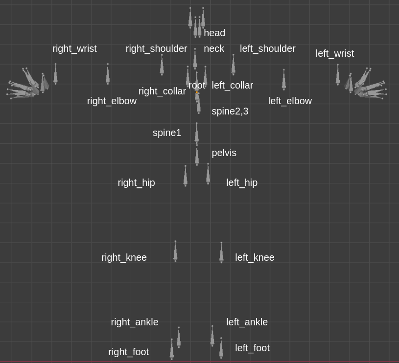

# AUTOMATIC HUMAN POSE RETARGETING ALGORITHM FOR MOTION CAPTURE SYSTEM

## Table of Contents
- [Description](#description)
  - [Data](#data)
  - [Fitting](#fitting)
- [Dependencies](#dependencies)

## Description
This repository contains the code used for transfer pose, the pose result from SMPLify-X (.pkl), to another model that has different rigging orientations.
### Data
The require data consist of ```config.yaml```, ```destination_model.fbx``` , and ```pose.pkl``` then place to the right folder. You should have the following folder structure:
```
lcmocap
├── config_files
│   ├── config.yaml
├── input
│   ├── destination
│       ├── destination_model.fbx
│   ├── source
│       ├── pose.pkl
```
#### Config file
Before fitting, you must edit the ```config.yaml``` by writing rigging names that relate to the source model and mesh name. Please select only 22 riggings that are identical to the following image.

\

**Important!** joint names must sort like the following:
```yaml
datasets:
  mesh_name: 'SMPLX-mesh-male'
  joints:
    - pelvis
    - left_hip
    - right_hip
    - spine1
    - left_knee
    - right_knee
    - spine2
    - left_ankle
    - right_ankle
    - spine3
    - left_foot
    - right_foot
    - neck
    - left_collar
    - right_collar
    - head
    - left_shoulder
    - right_shoulder
    - left_elbow
    - right_elbow
    - left_wrist
    - right_wrist
```

### Fitting
Run the following command to execute the code:
```
python lcmocap/main.py --config config_files/config.yaml
```
where the **output/retargeting** is the folder that contains the resulting pose.

## Dependencies
- [Blender Python API](https://docs.blender.org/api/current/index.html)
- [Numpy](https://numpy.org/)
- [Pandas](https://pandas.pydata.org/)

The code has been tested with python 3.7 and Blender API 2.91 on Ubuntu 18.04.

### Alternative way
You can using this on container by building Docker file [Here](Dockerfile).

